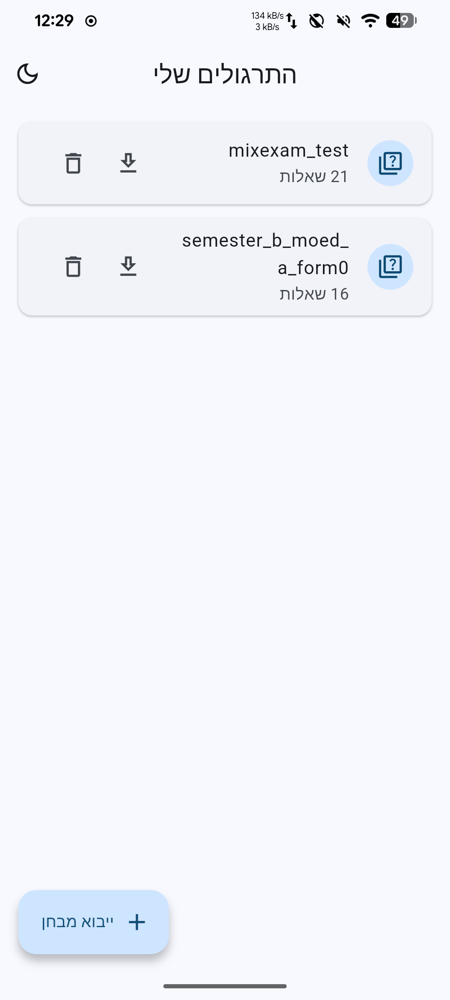
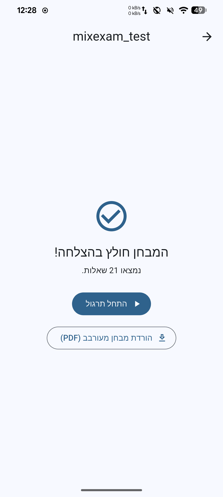
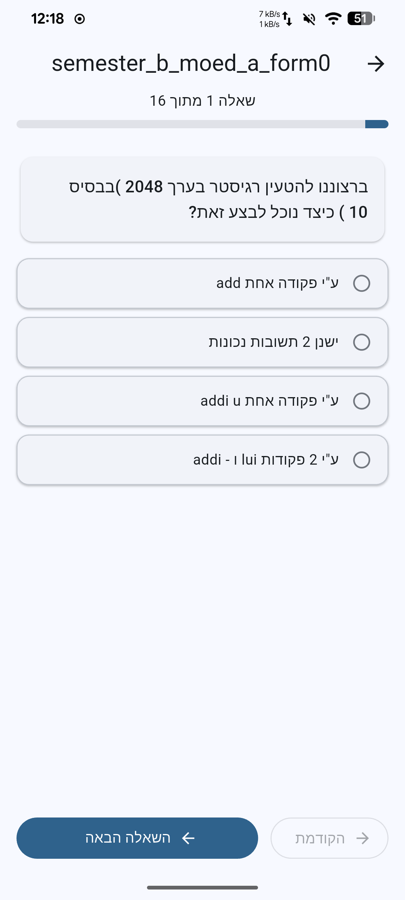
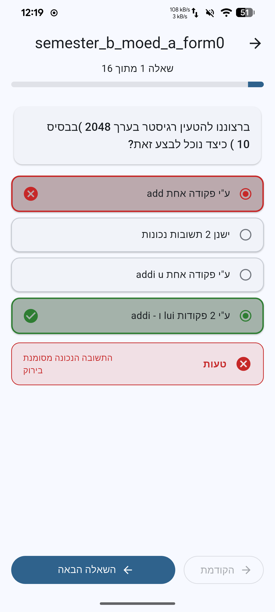
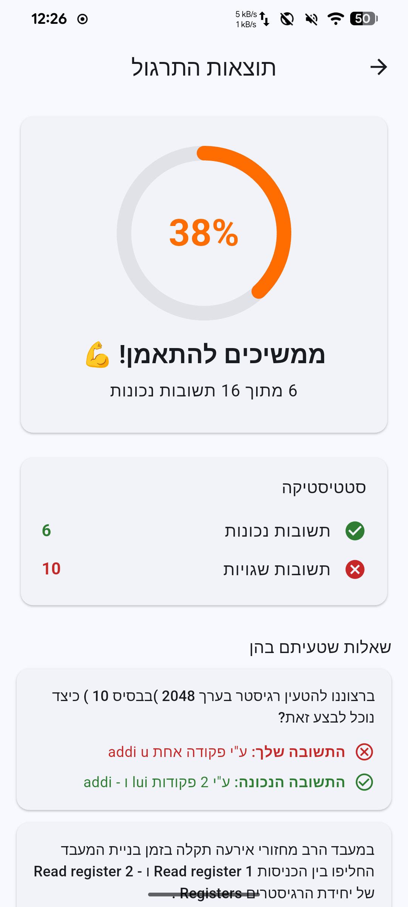
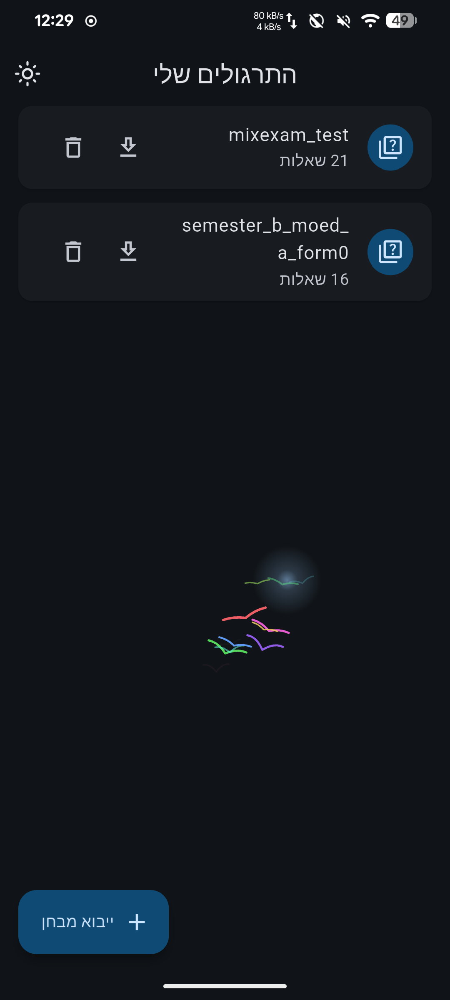

# JCT MixExam

A fully offline, cross-platform (Android/iOS) Flutter app for practicing
JCT "Zero-Exams" (מבחני אפס — exams where the first answer choice is always
the correct one).

You import a PDF of a Zero-Exam; the app parses it on-device, extracts the
questions and answers, **shuffles the text answers** so you can't memorize
the correct answer by position, and gives you an interactive practice
session with immediate self-checking. All processing is 100% local — no
network calls, no PDFs leave your device.

## Features

- **Import & parse PDFs entirely on-device.** Parsing (PDF loading, regex
  scanning, Hebrew bidi correction, image cropping) runs in a background
  isolate via `compute()`, so the UI never freezes.
- **Answer shuffling.** Extracted text answers are shuffled each session,
  and the originally-correct answer is never left in the first position.
- **Immediate feedback.** Picking an answer locks the question and marks it
  at once — your pick in red if wrong, the correct one in green. A correct
  answer auto-advances to the next question.
- **Download the shuffled exam as a PDF.** The reordered exam is re-stamped
  in the original layout, so you can print or practice on paper.
- **Visual questions (diagrams / Karnaugh maps / circuits).** Questions the
  parser can't safely turn into shuffled text fall back to an image of the
  question body, cropped **above** the original answers so the Zero-Exam
  layout isn't revealed. A "Reveal original answers" button shows the full
  original image on demand.
- **Hebrew-first, fully RTL** UI with Material 3 and a light/dark theme
  toggle (persisted).
- **Local storage.** Parsed exams are saved (Hive), so heavy PDFs are
  processed only once.

## Screenshots

| Home | Processing | Practice |
|:---:|:---:|:---:|
|  |  |  |
| **Answer feedback** | **Results** | **Dark mode** |
|  |  |  |

## Tech stack

- **Flutter** (Dart), **Material 3**, global RTL.
- **flutter_riverpod** for state management.
- **Hive** + **SharedPreferences** for local storage / settings.
- **file_picker** for choosing a local PDF.
- **syncfusion_flutter_pdf** for text extraction, **pdfx** for rendering
  visual-question images.

The code follows Clean Architecture:

```
lib/
  core/          # constants, theme, utils, error types
  data/          # Hive storage + the PDF parsing engine
  domain/        # Exam / Question / Answer models + repository contract
  application/   # Riverpod providers and controllers
  presentation/  # screens and widgets
```

## Requirements

- **Flutter 3.44.7** (Dart 3.12.2). Newer 3.x versions likely work, but the
  Android build is pinned to an older Gradle toolchain (see below), which
  matches this Flutter version.
- **Android:** the project pins **AGP 8.7.3 / Kotlin 2.1.0 / Gradle 8.12**.
  This is intentional — the Flutter 3.44 default (AGP 9 "built-in Kotlin")
  fails to compile `file_picker`/`pdfx`, which still apply their own Kotlin
  Gradle plugin. Do not upgrade the Android toolchain until those plugins
  migrate. A JDK 17+ is required by AGP 8.7.
- **iOS** (optional): Xcode + CocoaPods.

## Setup

1. **Install Flutter 3.44.7** and put it on your `PATH`. Verify:

   ```bash
   flutter --version   # expect Flutter 3.44.7 • Dart 3.12.2
   ```

2. **Clone and fetch dependencies:**

   ```bash
   git clone https://github.com/Yeyois/ShuffleMyExam.git
   cd ShuffleMyExam
   flutter pub get
   ```

3. **Check your toolchain** (optional but helpful):

   ```bash
   flutter doctor
   ```

## Run

With a device or emulator connected (`flutter devices` to list them):

```bash
flutter run
```

Or build an installable Android debug APK:

```bash
flutter build apk --debug
# output: build/app/outputs/flutter-apk/app-debug.apk
```

### Using the app

1. On the home screen, tap **ייבוא מבחן** (the + button) and pick a
   Zero-Exam PDF.
2. Wait for the on-device parse to finish, then tap **התחל תרגול** — or
   **הורדת מבחן מעורבב (PDF)** to save the shuffled exam for printing.
3. Move through the questions with **השאלה הבאה** / **הקודמת** and pick an
   answer; it is marked right away, and a correct one advances on its own.
   Tap **סיים תרגול והצג ציון** for your score and a breakdown of mistakes
   (your answer in red, the correct one in green).

## Tests

```bash
flutter test          # unit + widget tests (host)
flutter analyze       # static analysis (should be clean)
```

There is also an on-device integration test that exercises the real parse +
image-render isolates:

```bash
flutter test integration_test/app_test.dart -d <device-id>
```

### Trying the parser on your own exam PDFs

Drop real PDFs into a `pdf_exams_files/` folder at the repo root (it is
**gitignored** — your exams stay local) and run the dev-harness probe,
which prints the parsed structure of whatever it finds:

```bash
flutter test test/data/parsing/real_pdf_probe_test.dart
```

## Notes & limitations

- **100% offline by design** — the app makes no network requests, and PDFs
  are never uploaded anywhere.
- **Scanned PDFs** (image-only, no text layer) can't be parsed; OCR is out
  of scope. Text-based exam PDFs work best.
- Some heavily-mangled exam templates route individual questions to the
  image fallback rather than risk mis-identifying the correct answer — a
  deliberate trade-off favoring data integrity over shuffling.

See `PRD.txt` for the product spec and `CLAUDE.md` for the agent
build/workflow guide.
